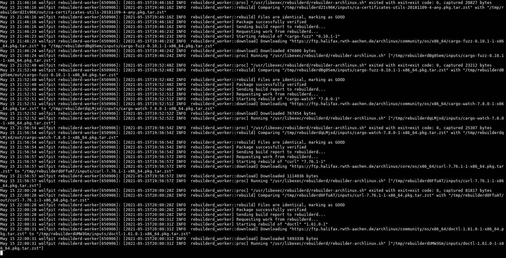

# rebuilderd(1) [![crates.io][crates-img]][crates] [![irc.freenode.net.org:6697/#rebuilderd][irc-img]][irc]

[crates-img]:   https://img.shields.io/crates/v/rebuilderd.svg
[crates]:       https://crates.io/crates/rebuilderd
[irc-img]:      https://img.shields.io/badge/freenode-%23rebuilderd-blue.svg
[irc]:          https://webchat.freenode.net/#rebuilderd

Independent verification system of binary packages.


- [Accessing a rebuilderd instance in your browser](#accessing-a-rebuilderd-instance-in-your-browser)
- [Scripting access to a rebuilderd instance](#scripting-access-to-a-rebuilderd-instance)
- [Running a rebuilderd instance yourself](#running-a-rebuilderd-instance-yourself)
    - [Rebuilding Arch Linux](#rebuilding-arch-linux) (Supported)
    - Rebuilding Debian (Planned)
- [Development](#development)
    - [Dependencies](#dependencies)
- [Funding](#funding)
- [License](#license)

rebuilderd monitors the package repository of a linux distribution and uses
rebuilder backends like [archlinux-repro][1] to verify the provided binary
packages can be reproduced from the given source code.

[1]: https://github.com/archlinux/archlinux-repro

It tracks the state of successfully verified packages and optionally generates
a report of differences with [diffoscope][2] for debugging. Note that due to
the early state of this technology a failed rebuild is more likely due to an
undeterministic build process instead of a supply chain compromise, but if
multiple rebuilders you trust report 100% reproducible for the set of packages
you use you can be confident that the binaries on your system haven't been
tampered with. People are encouraged to run their own rebuilders if they can
afford to.

[2]: https://diffoscope.org/

# Accessing a rebuilderd instance in your browser

Many instance run a web frontend to display their results. [rebuilderd-website]
is a very good choice and the software powering the Arch Linux rebuilderd
instance:

[rebuilderd-website]: https://gitlab.archlinux.org/archlinux/rebuilderd-website

https://reproducible.archlinux.org/

Loading the index of all packages may take a short time.

# Scripting access to a rebuilderd instance

It's also possible to query and manage a rebuilderd instance in a scriptable
way. It's recommended to install the `rebuildctl` commandline util to do this:

    pacman -S rebuilderd

You can then query a rebuilderd instance for the status of a specific package:

    rebuildctl -H https://reproducible.archlinux.org pkgs ls --name rebuilderd

You have to specify which instance you want to query because there's no
definite truth™. You could ask multiple instances though, including one you
operate yourself.

If the rebuilder seems to have outdated data or lists a package as unknown the
update may still be in the build queue. You can query the build queue of an
instance like this:

    rebuildctl -H https://reproducible.archlinux.org queue ls --head

If there's no output that means the build queue is empty.

If you're the administrator of this instance you can also run commands like:

    rebuildctl status

Or immediately retry all failed rebuild attempts (there's an automatic retry on
by default):

    rebuildctl pkgs requeue --status BAD --reset

# Running a rebuilderd instance yourself



"I compile everything from source" - a significant amount of real world binary
packages can already be reproduced today. The more people run rebuilders, the
harder it is to compromise all of them.

At the current stage of the project we're interested in every rebuilder there
is! Most rebuilderd discussion currently happens in #archlinux-reprodubile on
freenode, feel free to drop by if you're running a instance or considering
setting one up. Having a few unreproducible packages is normal (even if it's
slightly more than the official rebuilder), but having additional people
confirm successful rebuilds is very helpful.

## Rebuilding Arch Linux

Please see the setup instructions in the [Arch Linux Wiki](https://wiki.archlinux.org/index.php/Rebuilderd).

# Development

A rebuilder consists of the `rebuilderd` daemon and >= 1 workers:

Run rebuilderd:
```
cd daemon; cargo run
```

Run a rebuild worker:
```
cd worker; cargo run -- connect http://127.0.0.1:8484
```

Afterwards it's time to import some packages:
```
cd tools; cargo run -- pkgs sync archlinux community \
    'https://ftp.halifax.rwth-aachen.de/archlinux/$repo/os/$arch' \
    --architecture x86_64 --maintainer kpcyrd
```

The `--maintainer` option is optional and allows you to rebuild packages by a specific maintainer only.

To show the current status of our imported packages run:
```
cd tools; cargo run -- pkgs ls
```

To inspect the queue run:
```
cd tools; cargo run -- queue ls
```

## Dependencies

Debian: pkg-config liblzma-dev libssl-dev libsodium-dev libsqlite3-dev

# Funding

Rebuilderd development is currently funded by:

- ~~kpcyrd's savings account~~
- Google and The Linux Foundation
- People like you and me on [github sponsors](https://github.com/sponsors/kpcyrd)

# License

GPLv3+
